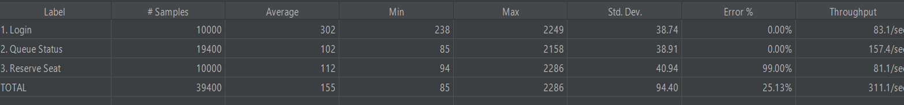

# DEAR TICKET


> 고가용성 아키텍처 기반의 실시간 티켓팅 시스템
> 인하공업전문대학 컴퓨터시스템공학과 2026 캡스톤 디자인

---

## 프로젝트 소개

DEAR TICKET은 대규모 트래픽이 단시간에 집중되는 티켓팅 환경에서 서비스 가용성과 데이터 정합성을 보장하는 실시간 티켓팅 시스템입니다.

Redis 분산 락 기반 동시성 제어, 실시간 대기열, AI 마이크로서비스(봇 탐지 / 개인화 추천 / 수요 예측)를 결합하여 수만 명이 동시에 접속하는 상황에서도 중복 예매 없이 안정적인 예매 환경을 제공합니다.

---

## 레포지토리

| 구분 | 링크 | 기술 |
|------|------|------|
| Backend | [ticketing-server](https://github.com/hyeonu8745/ticketing-server) | Java 21, Spring Boot, MySQL, Redis |
| Frontend | [ticketing-frontend](https://github.com/hyeonu8745/ticketing-frontend) | React 18 |
| AI Server | [ticketing-ai](https://github.com/hyeonu8745/ticketing-ai) | Python, FastAPI, PyTorch |

---

## 주요 기능

- **실시간 대기열** — Redis 기반 순번 대기열로 트래픽 분산
- **동시성 제어** — Redisson 분산 락으로 중복 예매 완전 방지
- **봇 탐지** — GraphSAGE 신경망 기반 비정상 트래픽 실시간 차단
- **개인화 추천** — RALLRec(TF-IDF + 코사인 유사도) 기반 유사 공연 추천
- **수요 예측** — Lag-Llama 시계열 모델로 혼잡도 및 매진 일시 예측
- **모니터링** — Prometheus + Grafana 실시간 인프라 관측

---

## Tech Stack

```
Frontend   React 18
Backend    Java 21 · Spring Boot 4 · Spring Security · JWT
Database   MySQL 8 · Redis 7 · Redisson
AI         FastAPI · PyTorch · scikit-learn
Infra      Docker · Docker Compose · Nginx
Monitoring Prometheus · Grafana
CI/CD      GitHub Actions
```

---

## 시스템 아키텍처

```
[React Frontend]
       │
       ▼
[Spring Boot :8080] ──→ [MySQL :3306]
       │            ──→ [Redis :6379]
       │
       ├──→ [Bot Detection  FastAPI :8000]
       ├──→ [Recommendation FastAPI :8001]
       ├──→ [Demand Forecast FastAPI :8002]
       └──→ [Chatbot        FastAPI :8003]

[Prometheus :9090] ← scrape ← [Spring Boot Actuator]
[Grafana    :3000] ← query  ← [Prometheus]
```

---

## 부하 테스트 결과

> JMeter 10,000 동시 사용자 시나리오 (Login → Queue → Reserve Seat)



| 항목 | 수치 |
|------|------|
| 동시 요청 수 | 10,000명 |
| 평균 응답 시간 | 155ms |
| 최소 응답 시간 | 85ms |
| 처리량 | 311.1 req/sec |
| 초과 예매 건수 | 0건 |

> Reserve Seat Error 99%는 좌석 수(100석) 초과 요청이 의도적으로 차단된 정상 동작입니다.
> 10,000명이 동시에 요청했지만 정확히 100석만 선점되었습니다.

---

## 개발자

| 학번 | 이름 |
|------|------|
| 202245099 | 지현우 |

지도교수: 용승림 교수님
소속: 인하공업전문대학 컴퓨터시스템공학과

---

## References

- [KOPIS 공연예술통합전산망](https://www.kopis.or.kr) — 공연 데이터 제공
- Hamilton et al. (2017) — GraphSAGE. NeurIPS 2017.
- Yao et al. (2023) — RALLRec. arXiv:2312.02445
- Rasul et al. (2024) — Lag-Llama. arXiv:2310.08278
